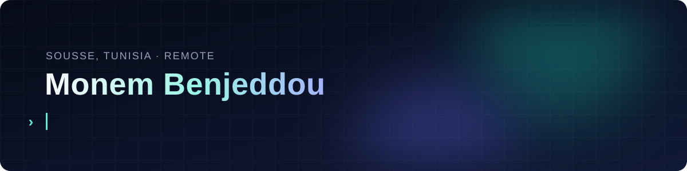

  

  
  
  

I build Python backends with FastAPI and Django, and the RAG and LLM agent systems that run on top of them. Right now I lead the backend of a distributed government platform in Saudi Arabia, used by 10,000+ staff.

  

## 🛠️ What I'm building with

   
  

**AI:** RAG · LangChain · Azure AI Search · Chroma · Azure OpenAI · Claude · Azure AI Foundry · Hugging Face models (AraBERTv2, GLiNER) · Presidio · CAMeL Tools

## 🚀 Things I've shipped in the open

| | |
|---|---|
| 📺 [**ScreenBeam**](https://github.com/Monem-Benjeddou/ScreenBeam) | Stream your Mac's screen and sound to an Android phone, and use the phone as a mouse, keyboard or game controller. |
| 📸 [**SnapStash**](https://github.com/Monem-Benjeddou/SnapStash) | Free screenshot tool for macOS: area, window and full-screen capture, text from screen, pin and drag. |
| 📋 [**ClipStash**](https://github.com/Monem-Benjeddou/ClipStash) | Clipboard history for macOS. Search everything you've copied and paste it again. |
| 🎚️ [**AppMixer**](https://github.com/Monem-Benjeddou/AppMixer) | Per-app volume control for macOS. No drivers. |
| 📦 [**BMDRM.LibSql.Core**](https://www.nuget.org/packages/BMDRM.LibSql.Core) | EF Core and LINQ provider for LibSQL, on NuGet. 11,000+ downloads. |
| 🎭 [**Orleans.Course**](https://github.com/Monem-Benjeddou/Orleans.Course) | Course code for Microsoft Orleans, the .NET virtual-actor framework. |

The government platform work is private. The numbers in the terminal above are from it.

## 🐍 Contributions

<picture>
  <source media="(prefers-color-scheme: dark)" srcset="https://raw.githubusercontent.com/Monem-Benjeddou/Monem-Benjeddou/output/github-snake-dark.svg">
  
</picture>

Sousse, Tunisia · Arabic, English, French

